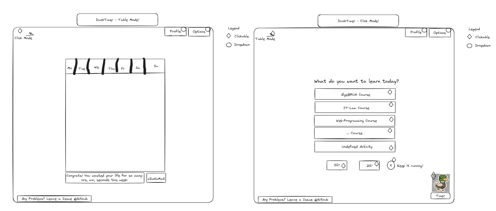

# Duck_Timer

Duck_Timer is a Pomodoro timer application built with FastAPI and HTMX. This project helps you track your work sessions using the Pomodoro Technique, featuring fun visual and audio feedback, that lets you save specific tasks and their durations.

THIS IS A WORK IN PROGRESS!

## Features

- Start, stop, and reset the Pomodoro timer
- Input tasks with customizable durations
- Dynamic task updates using HTMX
- Visual feedback with duck images and quacking sounds
- Task tracking saved in an SQLite database

## Why another Pomodoro timer?

Well, I wanted to learn more about FastAPI and HTMX, and I thought building a Pomodoro timer would be a fun project to work on. I also wanted to create a simple and lightweight timer that I could use to track my work sessions, where I could easily input tasks and their durations, that are then saved in a table via SQLite.

## Very basic Mockup of how I planned the project to look like:

